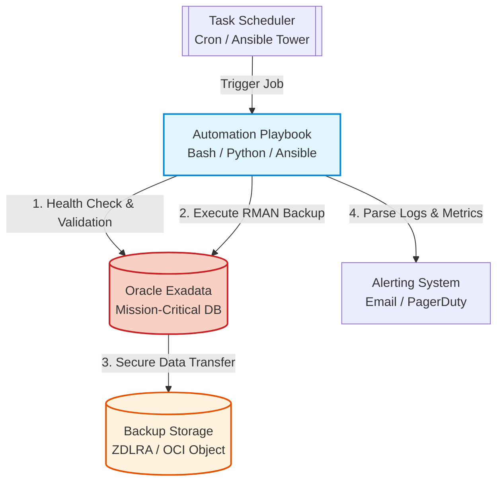

# DBA Automation Playbooks

## Overview
This repository contains a curated collection of automation scripts and playbooks designed to manage, secure, and maintain enterprise database environments. These scripts reflect my approach to reducing manual overhead in mission-critical infrastructure.

## Automation Architecture

## Focus Areas
* **Operational Efficiency:** Automated health checks and performance monitoring scripts to identify bottlenecks before they impact production.
* **Resilience:** RMAN-based backup and restoration automation playbooks to ensure data integrity and rapid recovery.
* **Compliance & Security:** Scripted patch management and configuration drift detection for Oracle Database environments.

## Technologies Used
* **Languages:** Bash, Python
* **Automation Frameworks:** Ansible
* **Core Systems:** Oracle Exadata, Enterprise Linux, OCI

## Key Philosophy
* "If it's done twice, automate it."
* Infrastructure as Code (IaC) principles: Version-controlled configuration ensures stability across large-scale deployments.
* Security first: Automated configuration validation against enterprise compliance standards.

---
*Created by Mohamed Mousa | Lead Cloud Architect*
